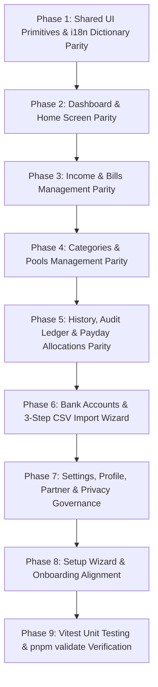

# Mobile-Web Feature Parity & Remediation Implementation Plan

## 1. Executive Summary & Web vs Mobile Gap Analysis Matrix

This plan itemizes every screen, modal, drawer, and capability across the platform, mapping current mobile status against web parity and prescribing the required remediation to bring the **Money Matters Mobile App** (`apps/mobile`) to **100% functional and UI/UX parity** with the **Web Application** (`apps/web`), adhering strictly to [AGENTS.md](file:///home/kaesava/projects/money-matters/AGENTS.md) (vertical slice architecture, zero hardcoded user-facing literals, strict type safety with no `any`, MECE principle, and full test coverage).

| # | Domain / Feature | Web Capability (`apps/web`) | Mobile Current Status (`apps/mobile`) | Parity Gap & Remediation Required |
|---|---|---|---|---|
| **1** | **Dashboard Hero & Metrics** | Hero card with household greeting, AEST timezone date, Net Worth / Total Balance, Safe-to-Spend Everyday pool, Regular Bills balance + next bill badge, Savings Goals total, Trial banner & status badge. | Basic Hero card with Everyday & Bills pool summary. | **Missing**: Linked bank balances summary, Trial banner / status badge, Next Bill due date badge, pull-to-refresh. |
| **2** | **Attention Items & Alerts** | Shortfall alerts, overdrawn categories, unallocated income events, missing schedules banner (`MissingSchedulesBanner`), bank balance reconciliation nudge (`BankReconcileCard`). | Partial `AttentionItemsList` (shortfalls & overdraws). | **Missing**: Missing Schedules Banner, Bank Reconciliation nudge card, 1-tap action deep linking. |
| **3** | **Quick Expense & 1-Tap Debits** | Quick Expense Drawer with segmented Debit/Credit, date selection, and **Quick Pick Badges** (Coffee $5.50, Lunch $18, Groceries $80, Fuel $70). | `QuickExpenseModal` with basic form. | **Missing**: Quick Pick Badges for 1-tap rapid entry, automatic category suggestion based on expense name. |
| **4** | **Can-Afford Simulator** | Interactive simulation testing custom purchase amounts against Everyday allowance without breaking ring-fenced bills. | Basic `CanAffordCard`. | **Missing**: Interactive modal expansion for custom amount testing with instant visual affordability breakdown. |
| **5** | **Goals Progress Strip** | Horizontal progress bar strip for active savings goals with percent achieved, target amount, and target completion date. | Goals listed only in Categories tab. | **Missing**: Dashboard quick-glance `GoalsProgressStrip` on mobile home. |
| **6** | **Income & Bills: 12-Month Matrix Plan** | Interactive 12-month forward-looking Cash-Flow Matrix projection grid (`MatrixPlanTab.tsx`), paydays vs recurring bills, surplus/deficit per pay period. | Paychecks screen only lists upcoming events & basic sources. | **Missing**: 12-Month Rolling Cash-Flow Matrix Tab / visual cash flow forecast on mobile. |
| **7** | **Income & Bills: Streams & Sources CRUD** | Full CRUD for recurring Income Streams and Expense Bills with frequency (weekly, fortnightly, monthly, annually), bank account mapping, category link, start/end dates. | Add only; basic delete. | **Missing**: Full Edit mode in `IncomeExpenseFormModal.tsx` with recurrence rule configuration, bank account mapping, and end dates. |
| **8** | **Income & Bills: Event Overrides & Bursts** | `EventOverrideModal` (date shift, amount adjustment, skip toggle, delete override), `SourceBurstDetailModal` (burst occurrences visual timeline). | Partial `EventOverrideModal` and `SourceBurstDetailModal`. | **Missing**: Full parity in event override options (skip occurrence vs edit amount) and visual burst inspection. |
| **9** | **Categories & Pools: Detail & Activity** | `CategoryDetailDrawer` (stats, target vs saved progress, linked bank account, file notes, transaction activity ledger), `MoveMoneyModal`, `ReconciliationModal`. | Pool lists, basic `CategoryFormModal`, `MoveMoneyModal`. | **Missing**: Dedicated `CategoryDetailModal` (or drawer) with itemized category activity ledger, linked bills, and file notes. |
| **10** | **Categories & Pools: Edit Form Parity** | `CategoryFormModal` supports creating/editing all 3 pool types (`EVERYDAY`, `REGULAR`, `GOAL`), target date for goals, bank account mapping, everyday keep allowance. | Basic `CategoryFormModal`. | **Missing**: Full Edit mode parity, target date picker for goals, bank account dropdown selector, rollover rules. |
| **11** | **History & Audit Ledger: MECE Consolidation** | 2-Tab History (`Transactions` ledger with paired transfer detection `Source ➔ Dest` + `Payday Allocations` audit log with `SlideOverAllocationDrawer`). | **MECE Violation**: `transactions.tsx` AND `settings/history.tsx` duplicate basic transaction lists; no Payday Allocations tab. | **Missing**: Consolidate into single 2-Tab History screen; add Payday Allocations history tab with `MobilePaydayAllocationDetailModal`. |
| **12** | **Bank Accounts: Provider Branding & Management** | Table of Bank Accounts with Bank Provider branding (CBA, Westpac, ANZ, NAB, ING, Macquarie, Other), Statement Balance, Unbudgeted Buffer, Stealth Private toggle, Pool mappings. | Basic account list with inline add form. | **Missing**: Bank Provider picker & branded logos, Edit account modal, Unbudgeted buffer field, Stealth Private toggle, Transfer Conflict warning modal. |
| **13** | **Bank Statements: 3-Step CSV Import Wizard** | Interactive 3-Step CSV Import Wizard: Step 1 Upload (Big 4 auto-detection) $\rightarrow$ Step 2 Interactive Review (category match, confidence score, duplicate detection) $\rightarrow$ Step 3 Commit. | Placeholder alert directing user to Web Dashboard. | **Missing**: Full Mobile 3-Step CSV Statement Import Wizard (`MobileCsvImportModal.tsx`) using `expo-document-picker` and batch tracking. |
| **14** | **Bank Statements: Batch Rollback** | List of previous CSV import batches (`listCsvImportBatches`) with batch ID, date, count, and 1-tap "Rollback Batch" button (`rollbackCsvBatch`). | Not implemented on mobile. | **Missing**: CSV Import Batches History & 1-Tap Rollback section in `settings/bank-accounts.tsx`. |
| **15** | **Paycheck Review & Waterfall Allocation** | 5-Step Waterfall calculation breakdown with per-line reasoning tooltips, user amount adjustments, and Bank Transfer Prompt / Instructions. | `paychecks/[id].tsx` & `transfer-instructions.tsx`. | **Missing**: Full 5-step waterfall step badges, adjustment inputs, calculation reasoning modals, and accurate bank account transfer routing. |
| **16** | **Settings: Profile & Details** | Edit User Name, Email (read-only), Timezone selector (Australian timezones), Avatar upload. | Read-only profile card. | **Missing**: Edit User Name form, Timezone picker, Avatar selector. |
| **17** | **Settings: Household Partner Management** | Invite partner by email, role selection (`MEMBER`/`ADMIN`), active invite list with status (Pending, Accepted, Expired), Revoke invite button, Resend invite button. | Basic send invite form. | **Missing**: Active invites list, Revoke invite action, Resend invite action. |
| **18** | **Settings: Household Danger Zone** | Re-setup Budget / Reset Allocations trigger, Account Deletion request with confirmation dialog. | Not implemented on mobile. | **Missing**: Household Danger Zone section with budget reset and account deletion flows. |
| **19** | **Settings: Privacy & Data Governance** | APPs 12 & 13 rights, GDPR/APP compliant full household data export (JSON/CSV download via `Share`), Data Erasure request form. | Static text description. | **Missing**: 1-tap APPs 12/13 Full JSON Data Export via `Share.share` and interactive Data Erasure request form. |
| **20** | **Onboarding / Setup Wizard** | Step 1 Income (name, amount, frequency, first payday date, receiving bank account) $\rightarrow$ Step 2 Categories/Bills presets $\rightarrow$ Step 3 Burst generation. | `(setup)` wizard with 2 steps. | **Missing**: First payday date picker (timezone-safe), excess sweep bucket selection, linked bank account setup. |

---

## 2. Grill Questions & Architectural Decisions

1. **Transaction History & Ledger Consolidation (MECE Principle)**:
   - *Decision*: Consolidate `apps/mobile/src/app/(app)/settings/history.tsx` and `apps/mobile/src/app/(app)/transactions.tsx`. The main tab `(app)/transactions.tsx` becomes the unified 2-Tab History view (`Transactions` & `Payday Allocations`). `settings/history.tsx` redirects directly to `/(app)/transactions?tab=payday-allocations` to eliminate duplicated code.
2. **Mobile 3-Step CSV Statement Import Workflow**:
   - *Decision*: Mobile will use `expo-document-picker` to select CSV files from the device filesystem or cloud storage, stream the content to `trpc.parseCsv`, present an interactive mobile card-based review list with duplicate detection badges, and commit via `trpc.importCsvTransactions` with batch ID tracking.
3. **12-Month Rolling Cash-Flow Matrix on Mobile**:
   - *Decision*: Mobile will render the 12-month projection via a horizontally scrollable pay-cycle timeline carousel (`MobileMatrixPlanTab.tsx`), allowing users to swipe through upcoming pay periods and inspect income vs ring-fenced bills per cycle.
4. **Component Reusability & Shared Tokens**:
   - *Decision*: Reusable pure logic, formatters, and types are sourced from `packages/types`, `packages/i18n`, and `packages/ui`. Mobile-specific UI elements live in `packages/ui/src/mobile` and `apps/mobile/src/components/`, strictly utilizing Serene Finance tokens (`#2563eb`, `#1B2B4B`, `#F7F8FA`, `#22c55e`, `#ba1a1a`).

---

## 3. Phase-by-Phase Remediation Roadmap



---

## Phase 1: Shared UI Primitives & i18n Dictionary Parity

### Objective
Ensure all required UI primitives exist in `packages/ui/src/mobile` and that all new user-facing copy is 100% externalized with 1:1 structural parity across `en.ts` and `ja.ts`.

### 1.1 New & Enhanced Mobile UI Primitives (`packages/ui/src/mobile/`)
- **BankProviderBadge.tsx** (`packages/ui/src/mobile/BankProviderBadge.tsx`):
  - Renders bank branding for CBA (amber), Westpac (red), ANZ (blue), NAB (dark red), ING (orange), Macquarie (charcoal), and Other (slate).
- **MobileTabs.tsx** (`packages/ui/src/mobile/MobileTabs.tsx`):
  - Segmented horizontal tab bar with active indicator, badge counts, and haptic feedback.
- **MobileDrawer.tsx** (`packages/ui/src/mobile/MobileDrawer.tsx`):
  - Bottom-sheet slide-over drawer for detailed category inspection, notes, and allocation history.
- **MobileDatePicker.tsx** (`packages/ui/src/mobile/MobileDatePicker.tsx`):
  - Timezone-safe date input utilizing `Intl.DateTimeFormat('en-CA', { timeZone: 'Australia/Sydney' })` to prevent UTC off-by-one errors.

### 1.2 i18n Dictionary Synchronization (`packages/i18n/src/dictionaries/`)
- Update `en.ts` and `ja.ts` with exact structural parity for:
  - `matrix.*`: 12-month projection matrix labels, surplus/deficit per cycle, pay period summary.
  - `csvImport.*`: 3-step wizard steps, duplicate flags, batch rollback confirmation.
  - `categoryDetail.*`: Category stats, linked bills, transaction activity, notes.
  - `dangerZone.*`: Reset budget, delete account, double-confirmation warnings.
  - `privacyGovernance.*`: APPs 12/13 export, erasure request.
- Run `pnpm check-i18n` to validate zero missing keys.

---

## Phase 2: Dashboard & Home Screen Parity

### Objective
Upgrade `apps/mobile/src/app/(app)/home.tsx` to display all dashboard intelligence cards, quick actions, attention banners, and pull-to-refresh.

### 2.1 Attention Items & Missing Schedules Banner
- **File**: `apps/mobile/src/components/AttentionItemsList.tsx`
- **Features**:
  - Add `MissingSchedulesBanner`: Detect categories where `monthlyAmount` is missing or zero and display an attention warning with a 1-tap "Configure Targets" button linking to `/(app)/categories`.
  - Add `BankReconcileCard`: Nudge user to verify statement balances when last reconciliation was >14 days ago.
  - Add Shortfall / Overdraw resolution shortcuts (opening `MoveMoneyModal`).

### 2.2 Quick Action FAB & Quick Pick Badges
- **File**: `apps/mobile/src/components/QuickExpenseModal.tsx`
- **Features**:
  - Add `QuickPickBadges` strip: 1-tap chips for common Everyday purchases (`☕ Coffee $5.50`, `🥗 Lunch $18.00`, `🛒 Groceries $80.00`, `⛽ Fuel $70.00`).
  - Auto-select category and amount upon tapping a quick-pick badge.
  - Include negative balance check warning if expense exceeds available Everyday allowance.

### 2.3 Goals Progress Strip & Bank Balances Strip
- **Files**:
  - `apps/mobile/src/components/dashboard/GoalsProgressStrip.tsx`
  - `apps/mobile/src/components/dashboard/BankBalancesStrip.tsx`
- **Features**:
  - Render active savings goals with horizontal progress meters, percentage saved, and target dates.
  - Render linked bank accounts with provider badges and last known statement balances.

### 2.4 Pull-to-Refresh & Trial Status Banner
- **File**: `apps/mobile/src/app/(app)/home.tsx`
- **Features**:
  - Add `RefreshControl` refreshing `trpc.listPools`, `trpc.listCategories`, `trpc.getTenant`, `trpc.listIncomeEvents`, `trpc.listExpenseEvents`.
  - Display `TrialBanner` when household is on trial with remaining days and upgrade button.

---

## Phase 3: Income & Bills Management Parity

### Objective
Provide complete parity for recurring income streams, expense bills, event overrides, burst inspection, and the 12-month forward-looking matrix.

### 3.1 12-Month Rolling Cash-Flow Matrix
- **File**: `apps/mobile/src/components/paychecks/MobileMatrixPlanTab.tsx`
- **Features**:
  - Integrate `trpc.listCashFlowMatrix.useQuery()`.
  - Render horizontal pay-cycle cards showing Payday Date, Expected Income, Ring-Fenced Bills Total, Savings Goals Total, Remaining Everyday Pool, and Cumulative Surplus/Deficit.
  - Expandable accordion per pay cycle listing all scheduled bills falling within that pay window.

### 3.2 Full CRUD for Income & Expense Sources
- **File**: `apps/mobile/src/components/IncomeExpenseFormModal.tsx`
- **Features**:
  - Full Create and Edit modes for both Income and Expense sources.
  - Recurrence rules support: Weekly, Fortnightly, Monthly, Quarterly, Annually (`rrule`).
  - Start Date picker and optional End Date picker.
  - Bank Account selector (`receivingAccountId` / `payingAccountId`).
  - Category selector with pool type indicator.
  - Notice on edit: "Paydays/bills already confirmed/paid won't be changed. Only unperformed future occurrences will update."

### 3.3 Event Override & Burst Inspection Parity
- **Files**:
  - `apps/mobile/src/components/EventOverrideModal.tsx`
  - `apps/mobile/src/components/SourceBurstDetailModal.tsx`
- **Features**:
  - Support: (a) Edit single occurrence date/amount, (b) Skip single occurrence, (c) Reset to source default.
  - Burst Modal: Visual chronological list of all future occurrences generated by a recurring stream with status badges.

---

## Phase 4: Categories & Pools Management Parity

### Objective
Elevate category management to full parity, adding dedicated category detail drawers, complete editing, and balance reconciliation.

### 4.1 Dedicated Category Detail Drawer (`CategoryDetailModal.tsx`)
- **File**: `apps/mobile/src/components/categories/CategoryDetailModal.tsx`
- **Features**:
  - Triggered upon tapping any category card across Everyday, Regular Bills, or Savings Goals.
  - Displays: Current Balance, Target Monthly Amount, Linked Bank Account, Next Scheduled Bill Date, Health Status (`ON_TRACK`, `APPROACHING`, `DEFICIT`).
  - **Itemized Category Ledger**: Filtered list of all past transactions for this category.
  - **File Notes Section**: Embedded note-taking for household context.
  - Actions: Edit Category, Move Money, Archive Category.

### 4.2 Full Category Edit Mode Parity
- **File**: `apps/mobile/src/components/CategoryFormModal.tsx`
- **Features**:
  - Full support for Create and Edit modes across `EVERYDAY`, `REGULAR`, and `GOAL`.
  - Target Amount, Monthly Amount, Target Date picker (for Goals), Everyday Keep Allowance, Bank Account Link dropdown.
  - Real-time budget impact calculation preview.

### 4.3 Category Balance Reconciliation Helper
- **File**: `apps/mobile/src/components/categories/MobileReconciliationModal.tsx`
- **Features**:
  - Compares sum of category balances against actual bank statement balances.
  - Visual delta indicator ($+\Delta$ or $-\Delta$) with 1-tap "Auto-reconcile to Everyday pool" mutation.

---

## Phase 5: History, Audit Ledger & Payday Allocations Parity

### Objective
Consolidate transaction views under the MECE principle into a unified 2-Tab History screen with transfer grouping and full payday waterfall audit inspection.

### 5.1 Unified 2-Tab History Screen (`apps/mobile/src/app/(app)/transactions.tsx`)
- **File**: `apps/mobile/src/app/(app)/transactions.tsx`
- **Features**:
  - **Tab 1: Transactions Ledger**:
    - Paired Transfer Detection: Group matching debit/credit transfers into a single `Source Pool ➔ Destination Pool` transfer row.
    - Filter Bar: Search by note/category/amount, Filter by Flow (`ALL`, `DEBIT`, `CREDIT`, `TRANSFER`), Filter by Pool (`ALL`, `EVERYDAY`, `REGULAR`, `GOAL`).
    - Sort By: Date, Description, Amount (Asc/Desc).
    - Mobile Pagination Bar (10, 25, 50 per page).
    - CSV Export via `Share.share` with timezone-formatted filename (`transactions_export_YYYY-MM-DD.csv`).
  - **Tab 2: Payday Allocation History**:
    - List of historical waterfall runs (`trpc.listAllAllocationPlans.useQuery()`).
    - Summary card per allocation: Date, Income Source Name, Receiving Bank Account, Net Income Amount, Status (`CONFIRMED`).
    - Tapping opens `MobilePaydayAllocationDetailModal`.
    - CSV Export for all allocation lines.

### 5.2 Payday Allocation Detail Modal
- **File**: `apps/mobile/src/components/paychecks/MobilePaydayAllocationDetailModal.tsx`
- **Features**:
  - Mobile equivalent of Web's `SlideOverAllocationDrawer`.
  - Displays total net income, timestamp, receiving bank account.
  - Itemized waterfall line breakdown: Category Name, Confirmed Amount, Step (Deficit Repair, Essential, Standard, Goals, Everyday), and calculation reasoning note.

### 5.3 Redundant Route Redirection (MECE Compliance)
- **File**: `apps/mobile/src/app/(app)/settings/history.tsx`
- **Action**: Refactor to immediately redirect to `/(app)/transactions?tab=payday-allocations` to eliminate duplicated logic.

---

## Phase 6: Bank Accounts & Mobile 3-Step CSV Statement Import Wizard

### Objective
Bring full provider branding, account editing, stealth privacy toggles, and an interactive 3-step CSV statement import wizard with batch rollback to mobile.

### 6.1 Bank Accounts Management & Provider Branding
- **Files**:
  - `apps/mobile/src/app/(app)/settings/bank-accounts.tsx`
  - `apps/mobile/src/components/BankAccountFormModal.tsx`
- **Features**:
  - Bank Provider selector with branded badges (CBA, Westpac, ANZ, NAB, ING, Macquarie, Other).
  - Unbudgeted Buffer amount input.
  - Stealth Private Account toggle (`isPrivate`) to hide balance from secondary household users.
  - Linked Pool Types mapping with `TransferConflictModal` warning when moving a pool from another account.

### 6.2 Interactive 3-Step CSV Statement Import Wizard
- **File**: `apps/mobile/src/components/csv-import/MobileCsvImportModal.tsx`
- **Steps**:
  1. **Step 1: Upload & Account Select**:
     - Pick CSV via `expo-document-picker` (supports Big 4 bank exports: CBA, Westpac, ANZ, NAB, ING, Macquarie).
     - Select target destination bank account.
     - Call `trpc.parseCsv.useMutation()`.
  2. **Step 2: Interactive Review & Matching**:
     - Card-based review list of parsed transactions with Date, Description, Amount, Flow (Debit/Credit).
     - Auto-matched category dropdown with confidence score badge.
     - Duplicate Detection flag (comparing against existing ledger transactions in DB).
     - Exclude toggle switch per transaction.
     - Add new category inline shortcut.
  3. **Step 3: Commit & Import Summary**:
     - Batch commit via `trpc.importCsvTransactions.useMutation()`.
     - Displays total imported count, created categories, and batch reference.

### 6.3 CSV Batch History & 1-Tap Rollback
- **File**: `apps/mobile/src/app/(app)/settings/bank-accounts.tsx`
- **Features**:
  - List of past import batches (`trpc.listCsvImportBatches.useQuery()`) with batch ID, timestamp, and transaction count.
  - 1-tap "Rollback Import" button invoking `trpc.rollbackCsvBatch.useMutation()` with confirmation dialog.

---

## Phase 7: Settings, Profile, Partner Management & Privacy Governance

### Objective
Complete household governance, profile personalization, partner invite lifecycle, and Australian Privacy Principles data rights.

### 7.1 Profile Details & Personalization
- **File**: `apps/mobile/src/components/settings/MobileProfileSection.tsx`
- **Features**:
  - Edit User Name mutation (`trpc.updateUserPreferences.useMutation()`).
  - Timezone picker supporting Australian timezones (`Australia/Sydney`, `Australia/Melbourne`, `Australia/Brisbane`, `Australia/Perth`, `Australia/Adelaide`).
  - Read-only email display.

### 7.2 Household Partner Invite Lifecycle
- **File**: `apps/mobile/src/components/settings/HouseholdPartnerInviteSection.tsx`
- **Features**:
  - Invite partner by email with Role selection (`MEMBER` / `ADMIN`).
  - List active pending/accepted invites (`trpc.listPartnerInvites.useQuery()`).
  - Revoke Invite button (`trpc.revokePartnerInvite.useMutation()`).
  - Resend Invite button.

### 7.3 Household Danger Zone
- **File**: `apps/mobile/src/components/settings/HouseholdDangerZoneSection.tsx`
- **Features**:
  - **Reset Budget / Re-setup Wizard**: Clears targets and opens setup wizard with confirmation dialog.
  - **Account Deletion / Erasure**: Initiates APPs data erasure request with double-confirmation modal.

### 7.4 Privacy Governance & APPs 12/13 Full Data Export
- **File**: `apps/mobile/src/components/settings/PrivacyGovernanceSection.tsx`
- **Features**:
  - **1-Tap APPs 12/13 Full JSON Export**: Downloads full household archive (pools, categories, transactions, bank accounts, allocations) and triggers native `Share.share` dialog.
  - Contact Data Governance Officer link (`info@moneymatters.kaesava.au`).

---

## Phase 8: Setup Wizard & Onboarding Alignment

### Objective
Ensure mobile onboarding aligns with web setup, capturing first payday dates, receiving bank accounts, and sweep categories.

### 8.1 Setup Income Step
- **File**: `apps/mobile/src/app/(setup)/income.tsx`
- **Features**:
  - Add First Payday Date picker (timezone-safe).
  - Add Initial Receiving Bank Account name input.

### 8.2 Setup Categories & Bills Step
- **File**: `apps/mobile/src/app/(setup)/categories.tsx`
- **Features**:
  - Australian family presets selection (`AUSTRALIAN_FAMILY_PRESETS`).
  - Custom category addition with target monthly amount.
  - Excess Sweep Bucket selector (defaulting to Emergency Fund or Everyday).
  - Parallel batch creation using `Promise.all` wrappers (preventing N+1 loops).

---

## Phase 9: Test Coverage, Documentation Update & Verification

### Objective
Verify full test coverage across mobile components, update system specifications, and execute the complete verification shortcut.

### 9.1 Vitest Unit Testing Coverage
- Create unit tests under `apps/mobile/src/`:
  - `apps/mobile/src/components/__tests__/AttentionItemsList.test.tsx`
  - `apps/mobile/src/components/__tests__/QuickExpenseModal.test.tsx`
  - `apps/mobile/src/components/__tests__/CategoryFormModal.test.tsx`
  - `apps/mobile/src/components/__tests__/MobileCsvImportModal.test.tsx`
  - `apps/mobile/src/components/__tests__/MobileMatrixPlanTab.test.tsx`
  - `apps/mobile/src/lib/format.test.ts`

### 9.2 Documentation Integrity Update
- Update `TECHNICAL_SPEC.md`, `FUNCTIONAL_SPEC.md`, and `README.md` to reflect mobile 1:1 feature parity.

### 9.3 Verification Shortcut Pipeline
- Execute the mandatory command:
```bash
pnpm validate
```
This runs:
1. `pnpm install`
2. `pnpm typecheck` (strict TypeScript, zero `any`, zero `@ts-ignore`)
3. `pnpm test:coverage` & `pnpm test` (all Vitest suites passing)
4. `pnpm check-i18n` (100% parity across `en.ts` and `ja.ts`)
5. `pnpm lint`
6. `pnpm build`
